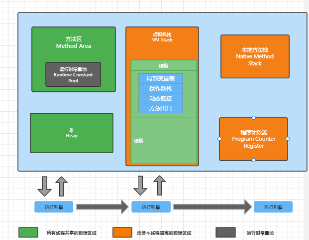

# JVM篇

## **<center>JVM基本概念</center>**

JVM是可运行java代码的可想计算机，包括一套字节码指令集、一组寄存器、一个栈、一个垃圾回收、堆 和 一个存储方法域。JVM是运行在操作系统之上的，他没有直接与硬件直接交互。


2）运行过程：

 我们都知道Java源文件，通过编译器，能够生产对应的Class文件，也就是字节码文件，而字节码文件又通过Java虚拟机中的解释器，编译成特定机器上的机器码。

也就是如下

- java源文件——>编译器———>字节码文件
- 字节码文件—>JVM——>机器码

每一种平台的解释器是不同的，但是实现的虚拟机是相同的，这也就是java为什么能够跨平台的原因了，当一个程序从开始运行，这时虚拟机就开始实例化了，多个程序启动就会存在多个虚拟机实例。程序退出或者关闭，则虚拟机是实例之间数据不能共享。


这里所说的线程指程序执行过程中的一个线程实体。JVM允许一个应用并发执行多个线程。HotSpot JVM中的java线程与原生的操作系统线程有直接的映射关系。当线程本地存储、缓冲区分配、同步对象、栈、程序计数器等准备好以后，就会创建一个操作系统原生线程。Java线程结束，原生线程随之被回收。操作系统负责调度所有的线程，并把他们分配到任何可用的CPU上。当原生线程初始化完毕，就会调用Java线程run()方法。当线程结束时，会释放原生线程和Java线程的所有资源。

Hotspot JVM后台运行的系统线程主要有下面几个：

| 虚拟机线程（VM thread） | 这个线程等待JVM到达安全点操作出现。这些操作必须要再独立的线程里执行，因为当堆修改无法进行时，线程都需要JVM位于安全点。这些操作的类型有：stop-the-world垃圾回收、线程栈dump、线程暂停、线程偏向锁（biased locking）解除。 |  |
| --- | --- | --- |
| 周期性任务线程 | 这线程负责定时事件（也就是中断），用来调度周期性操作的执行。 |  |
| GC线程 | 这些线程支持JVM中不同的垃圾回收活动。 |  |
| 编译器线程 | 这些线程在运行时将字节码动态编译成本地平台相关的机器码。 |  |
| 信号分发线程 | 这个线程接收发送到JVM的信号并调用适当的JVM方法处理。 |  |

## **JVM内存区域**


  

 JVM内存区域主要分为线程私有区域【程序计数器、虚拟机栈、本地方法区】、线程共享区域【JAVA堆、方法区】、直接内存。  线程私有数据区域生命周期与线程相同，依赖用户线程的启动/结束而创建/销毁在 Hotspot VM内，每个线程都与操作系统的本地线程直接映射，因此这部分内存区域的存/否 跟随本地线程的生/死对应.线程共享区域随虚拟机的启动/关闭而创建/销毁。

直接内存并不是JVM运行时数据区的一部分，但也会被频繁的使用：在JDK1.4引入的NIO提供了基于Channel与BufferIO方式。他可以使用Native函数库直接分配堆外内存，然后使用DirectByteBuffer对象这块内存的引用进行操作。这样就避免了在Java堆和Native堆中来回复制数据，因此在一些场景中可以显著提高性能。



**程序计数器（线程私有）**

一块较小的内存空间，是当前线程所执行的字节码的行号指示器，每条线程都要有一个独立的程序计数器，这类内存也成为“线程私有”的内存。正在执行java方法的话，计数器记录的是虚拟机字节码指令的地址（当前指令的地址）。如果还是Native方法，则为空。这个内存区域是唯一一个在虚拟机没有规定任何OutOfMemoryError情况的区域。

**虚拟机栈（线程私有）**

 是描述java方法执行的内存模型，每个方法在执行的同时都会创建一个栈帧（Stack Frame）用于存储局部变量表、操作数栈、动态链接、方法出口等信息。每个方法从调用直至执行完成的过程，就对应着一个栈帧的在虚拟机栈中入栈到出栈的过程。栈帧（Frame）是用来存储数据和部分过程结果的数据结构，同时也被用来处理动态链接（Dynamic Linking）、方法返回值和异常分派（Dispatch Exception）。栈帧随着方法调用而创建，随着方法结束而销毁—无论方法是正常完成还是异常完成（抛出了在方法内未被捕获的异常）都算作方法结束。
   **本地方法区（线程私有）**

本地方法区和Java Stack作用类似，区别是虚拟机栈为执行Java方法服务，而本地方法栈为Native方法服务，如果一个VM实现使用C-linkage模型来支持Native调用，那么该栈将会是一个C站，但HotSpot VM 直接就把本地方法栈和虚拟机栈合二为一。

   **堆（Heap-线程共享）-运行时数据区**

 是被线程共享的一块内存区域，创建的对象和数据都保存在Java堆内存中，也是垃圾收集器进行垃圾收集的重要的内存区域。由于现在的VM采用**分代收集算法**，因此Java堆从GC的角度还可以细分为：新生代（Eden区、 From Survivor区和 To Survivor区）和**老年代**

   **方法区/永久代（线程共享）**

  即我们常说的**永久代（Permanent Generation）**，用于存储被**JVM加载的类信息、常量、静态变量、即使编译器编译后的代码**等数据，HosSpot VM 把GC 分代收集扩展至方法区，即**使用Java堆的永久代来实现方法区**，这样HotSpot的垃圾收集器就可以像管理Java堆一样管理这部分内存，而不必为方法区开发专门的内存管理器（永久代的内存回收的主要目标是针对**常量池的回收**和**类型的卸载**，因此收益一般很小）。运行时常量池（Runtime Constant Pool）是方法区的一部分。Class文件中除了有类的版本、字段、方法、接口等描述等信息外，还有一项信息是常量池（Constant Pool Table），用于存放编译期生成的各种字面量和符号引用，这部分内容将在类加载后存放到方法区的运行时常量池中，Java虚拟机对Class文件的每一部分（自然也包括常量池）的格式都有严格的规定，每一个字节用于存储那种数据都必须符合规范上的要求，这样才会被虚拟机认可、装载和执行。

 **<center>JVM运行时内存</center>**

Java堆从GC的角度还可以细分为：新生代（Eden区、 From Survivor区和 To Survivor区）和老年代。


   **新生代**

是用来存放新生的对象。一般占据堆的1/3空间。由于频繁的创建对象，所以新生代会频繁触发MinorGC进行垃圾回收。新生代又分为Eden区、ServivorFrom、 ServivorTo三个区。

 **Eden区**

Java新对象的出生地（如果新创建的对象占用内存很大，则直接分配到老年代）。当Eden区内存不够的时候就会出发MinorGC，对新生代区进行一次垃圾回收。

**ServivorFrom**

上一次GC的幸运者，作为这一次GC的被扫描者。

**ServivorTo**

保留一次MinorGC过程中的幸存者。

**<center>MinorGC的过程（复制 -> 清空 - >互换）</center>**

MinorGC采用复制算法。

1：eden、servicorFrom**复制到ServicorTo**，年龄+1首先，把Eden和ServivorFrom区域中存活的对象复制到ServicorTo区域（如果有对象的年龄以及达到了老年的标准，则复制到老年代区），同时把这些对象的年龄+1（如果ServicorTo不够位置了就放到老年区）。
2：**清空eden、servicorFrom**
然后，清空Eden和ServicorFrom中的对象：

3：**ServicorTo和ServicorFrom互换**
最后，ServicorTo和ServicorFrom互换，原ServicorTo成为下一次GC的ServicorFrom区。

**老年代**

主要存放应用程序中生命周期长的内存对象。老年代的对象比较稳定，所以MajorGC不会频繁执行。在进行MajorGC前一般都先进行了一次MinorGC，使得新生代的对选哪个晋身入老年代，导致空间不够用才会触发。当无法找到足够打的连续空间分配给创建的较大对象时也会提前出发一次MajorGC进行垃圾回收腾出空间。MajorGC采用标记清除算法：首先扫描一次所有老年代，标记出存活的对象，然后回收没有标记的对象。MajorGC的耗时比较长，因为要扫描再回收。MajorGc会产生内存碎片，为了减少内存损耗，我们一般需要进行合并或者标记出来方便下次的直接分配。当老年代也满了装不下的时候，就会抛出OOM（Out of Memory）。

**永久代**

指内存的永久保存区域，主要存放Class和Meta（元数据）的信息，Class在加载的时候被放入永久区域，它和存放实例的区域不同，GC不会在主程序运行期对永久区域进行清理。所以这也导致了永久代的区域会随着加载的Class的增多而胀满，最终抛出OOM异常。

## **<center>JAVA8与元数据</center>**

 在Java8中，永久代已经被移除，被一个称为“元数据区”（元空间）的区域所取代。元空间的本质和永久代类似，元空间与永久代之间最大的区别在于：元空间并不在虚拟机中，而是使用本地内存。因此，默认情况下，元空间的大小仅受本地内存限制。类的元数据放入native memory，字符串池和类的静态变量放入java堆中， 这样可以加载多少类的元数据就不再由MaxPermSize控制，而有系统的实际可用空间来控制。

## **<center>垃圾回收与算法</center>**


**如何确定垃圾**

**引用计数法**

   在Java中，引用和对象时有关联的。如果要操作对象则必须引用进行。因此，很显然的办法是通过引用计数来判断一个对象是否可以回收。简单说，即一个对象如果没有任何与之关联的的引用，及他们的引用计算都不为0，则说明对象不太可能再被用到，那么这个对象就是可回收对象。

**可达性分析** 

  为了解决的引用计数法的循环引用问题。Java使用了可达性分析的方法。通过一系列的“GC roots” 对象作为起点搜索。如果在“GC roots” 和一个对象之间没有可达路径，则称该对象是不可达的。

要注意的是，不可达对象不等价于可回收对象，不可达对象变为可回收对象至少要经过两次标记过程。两次标记后仍然是可回收对象，则将面临回收。

 **标记清除算法（Mark-Sweep）**

最基础的垃圾回收算法，分为两个阶段、标注和清除。标记阶段标记处所有需要回收的对象，清除阶段回收被标记的对选哪个所占用的空间。如图


从图中我们就可以发现，该算法最大的问题是内存碎片化严重，后续可能发生大对象不能找到可利用空间的问题。
                     
**复制算法（copying）**

为了解决Mark-Sweep算法内存碎片化的缺陷而被提出的算法。按内存容量将内存划分为等大小的两块。每次只使用其中一块，当这一块内存满后将尚存活的对象复制到另一块上去，把已使用的内存清掉。如图：


这种算法虽然实现简单，内存效率高，不易产生碎片，但是最大的问题是可用内存被压缩到了原来的的一半。且存活对象增多的话，Copying算法的效率会大大降低。

**<center>标记整理算法（Mark-Compact）</center>**

结合了以上两个算法，为了避免缺陷而提出。标记阶段和Mark—Sweep算法相同，标记后不是清理对象，而是将存活对象那个移向内存的一端。然后清除端边界外的对象。如图：


**<center>分代收集算法</center>**

分代收集法是目前大部分JVM所采用的方法，其核心思想是根据对象存活的不同生命周期将内存划分为不同的域，一般情况下将GC堆划分为老生代（Tenured/Old Generation）和新生代（Young Generation）。老生代的特点是每次垃圾回收时只是有少量的对象需要被回收，新生代的特点是每次垃圾回收时都有大量的垃圾需要被回收，因此可以根据不同区域选择不同的算法。

**<center>新生代与复制算法</center>**

目前大部分JVM的GC对于新生代都采取Copying算法，因为新生代中每次垃圾回收都要回收大部分对象，即要复制的操作比较少，切通常并不是按照1:1来划分新生代。一般将新生代划分为一块较大的Eden空间和两个较小的Survivor空间（From Space， To Space），每次使用Eden空间和其中的一块Survivor空间，当进行回收时，将该两块空间中还存活的对象复制到另一块Survivor空间中。


**<center>老年代与标记复制算法</center>**

而老年代因为每次只回收少量对象，因而采用Mark-Compact算法。

1.JAVA虚拟机提到过的处于方法区的永生代（Permanet Generation），它用于存储class类常量，方法描述等。对于用户所能带的回收主要包括废弃常量和无用的类。

2.对象的内存分配主要在新生代的Eden Space和Survivor Space 的 From Space（Survivor 目前存放对象的那一块），少数情况会直接分配到老生代。

3.当新生代的Eden Space和From Space空间不足是就会发生一次GC，进行GC后，Eden Space和 From Space区的存活对选哪个会被挪到To Space，然后将Eden Space和From Space进行清理。

4.如果To Space无法足够存储某个对象，则将这个对象存储到老生代。

5.在进行GC后，使用的便是Eden Space和To Space了，如此反复循环。

6.当对象在Survivor区躲过一次GC后，其年龄就会+1.默认情况下年龄到达15的对对象会被移到老生代中。

## **<center>JAVA四种引用类型</center>**

**<center>强引用</center>**

 在Java中最常见的就是强引用，把一个对象赋给一个引用变量，这个引用变量就是一个强引用。当一个对象被强引用变量引用时，他处于可达状态，他是不可能被垃圾回收机制回收的，即是该对象以后永远都不会用到JVM也不会回收。因此强引用时造成Java内存泄露的主要原因之一。

 **<center>软引用</center>**
软引用需要用SoftReference类来实现，对于只有软引用的对象来说，当系统内存足够时它不会被回收，当系统内存空间不足时，他会被回收。软引用通常用在对内存敏感的程序中。

 **<center>弱引用</center>**

弱引用需要用WeakReference类来实现，它软引用的对象的生命存期更短，对于只有弱引用的对象来说，只要垃圾回收机制一运行，不管JVM的内存空间是否足够，总会回收该对象占用的内存。

 **<center>虚引用</center>**

虚引用需要PhantomReference类来实现，他不能单独使用，必须和引用对垒联合使用。虚引用的主要作用是跟踪对象被垃圾回收的状态。

## **<center>GC分代收集算法VS分区收集算法</center>**

### **<center>分代收集算法</center>**

当前主流VM垃圾收集都采用“分代收集”（Generational Collection）算法，这种算法会根据对象存活周期的不同将内存划分为几块，如JVM中的新生代、老年代、永久代，这样就可以根据各年代特点分别采用最适当的GC算法。

### **<center>在新生代-复制算法</center>**

每次垃圾收集都能发现大批对象已死，只有少量存活。因此选用复制算法，只需要付出少量存活对象的复制成本就可以完成收集。  

### **<center>在老年代-标记整理算法</center>**

因为对象存活率高，没有额外空间对它进行分配担保，就必须采用“标记-清理”或 “标记-整理“算法来进行回收，不必进行内存复制，且直接腾出空闲内存。

### **<center>分区收集算法</center>**

分区算法则将整个堆空间划分为连续的不同小区间，每个小区间独立使用，独立回收，这样做的好处是可以控制一次回收多少个小区间，根据目标停顿时间，每次合理的回收若干个小区间（而不是整个堆）从而减少一次GC所产生的停顿。

### **<center>GC垃圾收集器</center>**

  Java堆内存被划分为新生代和老年代两个部分，新生代主要使用复制和标记-清除垃圾回收算法；年老代主要使用标记-整理垃圾回收算法，因此java虚拟机中针对新生代和年老代分别提供了多种不同的垃圾收集器，JDK1.6中Sun HotSpot虚拟机的垃圾收集器如下：


## **<center>Serial垃圾收集器（单线程、复制算法）</center>**

 Serial（英文连续）是最基本垃圾收集器，使用复制算法，曾经是JDK1.3.1之前新生代唯一的垃圾收集器。Serial是一个单线程的收集器，它不但只会使用一个CPU或一条线程去完成垃圾收集工作，并且在进行垃圾收集的同时，必须暂停其他所有的工作线程，直到垃圾收集结束。Serial垃圾收集器虽然在收集垃圾过程中需要暂停其他所有的工作线程，但是它简单高效，对于限定单个CPU环境来说，没有线程交互的开销，可以获得最高的单线程垃圾收集效率，因此Serial垃圾收集器依然是java虚拟机运行在Client模式下默认的新生代垃圾收集器。

## **<center>ParNew垃圾收集器（Serial + 多线程）</center>**

ParNew垃圾收集器其实是Serial收集器的多线程版本，也使用复制算法，除了使用多线程进行垃圾收集之外，其余的行为和Serial收集器完全一样，ParNew垃圾收集器在垃圾收集过程中同样也要暂停所有其他的工作线程。

ParNew收集器默认开启和CPU数目相同的线程数，可以通过-XX：ParllelGCThreads参数来限制垃圾收集器的线程数。【Parallel：平行的】

ParNew虽然除了多线程外和Serial收集器几乎完全一样，但是ParNew垃圾收集器是很多java虚拟机在Server模式下新生代的默认垃圾收集器。

## **<center>Parallel Scavenge收集器（多线程复制算法、高效）</center>**

Parallel Scavenge 收集器也是一个新生代垃圾收集器，同样使用复制算法，也是一个多先后才能的垃圾收集器，它重点关注关注的程序达到一个可控制的吞吐量（Thoughput , CPU 用于运行用户代码的时间/CPU总消耗时间，即吞吐量=运行用户代码时间/（运行用户代码时间+垃圾收集时间）），高吞吐量可以最高效的利用CPU时间，尽快地完成程序的运算任务，主要适用于在后台运算而不需要太多交互的任务。自适应调解策略也是ParllelScavenge收集器与ParNew收集器的一个重要区别。

 ## **<center>SerialOld收集器（单线程标记整理算法）</center>**

Serial Old是Serial垃圾收集器年老代版本，它同样是单线程的收集器，使用标记-整理算法，这个收集器也主要是运行在Client默认的java虚拟机默认的年老代垃圾收集器。

在 Server模式下，主要有两个用途：

1. 在JDK1.5之前版本中与新生代Parallel Scavenge收集器搭配使用。
2. 作为年老代中使用CMS收集器的后诶垃圾收集方案。

新生代Serial与年老代Serial Old搭配垃圾收集过程图：


新生代Parallel Savenge收集器与ParNew收集器工作原理类似，都是多线程的收集器，都是用的是复制算法，在垃圾收集过程中都需要暂停所有的工作线程。新生代ParallelScavenge/ParNew与年老代Serial Old搭配垃圾收集过程图：


## **<center>Parallel Old收集器（多线程标记整理算法）</center>**

Parllel Old收集器是Parallel Scavenge的年老代版本，使用多线程的标记-整理算法，在JDK1.6才开始提供。在JDK1.6之前，新生代使用Parallel Scavenge 收集器只能搭配你那老带的Serial Old收集器，只能保证新生代的吞吐量优先，无法保证整体的吞吐量，Parallel Old 正式为了在年老代同样提供吞吐量优先的垃圾收集器，如果系统对吞吐量要求比较高，可以优先考虑新生代 Parallel Scavenge 和年老代Parallel Old 收集器的搭配策略。新生代Parallel Scavenge和年老代 Parallel Old收集器搭配运行过程图：


## **<center>CMS收集器（多线程标记清除算法）</center>**

Concurrent Mark Sweep（CMS）收集器是一种年老代垃圾收集器，其最主要目标获取最短垃圾回收停顿时间，和其他年老代使用标记-整理算法不同，他使用多线程标记-清除算法。

最短的垃圾收集停顿时间可以为交互比较高的程序提高用户体验。CMS工作机制相比其他的垃圾收集器来说更复杂，整个过程分以下4个阶段：

### **<center>初始标记</center>**

只是标记一下GC Roots能直接关联的对象，速度很快，仍然需要暂停所有的工作线程。

### **<center>并发标记</center>**

 进行GC Roots跟踪的过程，和用户线程一起工作，不需要暂停工作线程。

### **<center>重新标记</center>**

为了修正在并发标记期间，因用户程序继续运行而导致标记产生变动的那一部分对象的标记记录，仍然需要暂停所有的工作线程。

### **<center>并发清除</center>**

清除GC Roots不可达对象，和用户线程一起工作，不需要暂停工作线程。由于耗时最长的并发标记和并发清除过程中，垃圾收集线程可以和用户现在一起并发工作，所以总体上来看CMS收集器的内存回收和用户线程是一起并发的执行。

 CMS收集器工作过程：


## **<center>G1收集器</center>**

Garbage first 垃圾收集器是目前垃圾收集器理论发展的最前沿成果，相比与CMS收集器，G1收集器两个最突出的改进是：

1. 基于标记-整理算法，不产生内存碎片。
2. 可以非常精确控制停顿时间，在不牺牲吞吐量前提下，实现低停顿垃圾回收。

G1 收集器避免全区域垃圾收集，它把堆内存划分为大小固定的几个独立区域，并且跟踪这些区域的垃圾收集进度，同时在后台维护一个优先级列表，每次根据所允许的收集时间，优先回收垃圾最多的区域。区域划分和优先级区域回收机制，确保G1收集器可以在有限时间获得最高的垃圾收集效率。

## **<center>JAVA IO/NIO</center>**

### **<center>阻塞IO模型</center>**

最传统的一种IO模型，即在读写数据过程汇总会发生阻塞现象。当用户线程发出IO请求之后，内核回去查看数是否就绪，如果没有就绪就会等待数据就绪，而用户线程就会处于阻塞状态，用户线程交出CPU。当数据就绪之后，内核会将数据拷贝到用户线程，并返回结果给用户线程，用户线程才解除block状态。典型的阻塞IO模型的例子为：data = socket.read()；如果数据没有就绪，就会一直阻塞在read方法。

### **<center>非阻塞IO模型</center>**

当用户线程发起一个read操作后，并不需要等待，而是马上就得到了一个结果。如果结果是一个error时，他就知道数据还没有准备好，于是它可以在此啊发送read操作。一旦内核中的数据准备好了，并且有再次收到了用户线程的请求，那么他马上就将数据拷贝到了用户线程，然后返回。所以事实上，在费阻塞IO模型中，用户线程需要不断地询问内核数据是否就绪，也就说非阻塞IO不会交出CPU，二回一直占用CPU。典型的非阻塞IO模型一般如下：

```java
while(true){
 data = socket.read();
 if(data!= error){
   //处理数据
   break;
 }
}
```

但是对于非阻塞IO就有一个非常严重的问题，在while循环中需要不断地区询问内核数据是否就绪，这样会导致CPU占用率非常高，因此一般情况下很少使用while循环这种方式来读取数据。

### **<center>多路复用IO模型</center>**

多路复用IO模型是目前使用得比较多的模型。 Java NIO实际上就是多路复用IO。在多路复用IO模型中，会有一个线程不断的去轮询多个socket的状态，只有当socket真正有读写时间时，才真正调用实际的IO读写操作。因为在多路复用IO模型中，只需要使用一个线程就可以管理多个socket，系统不需要建立新的进程或者线程，也不必维护这些线程和进程，并且只有在真正有socket读写事件进行时，才会使用IO资源，所以它大大减少了资源占用。在JAVA NIO中，是通过selector.select()去查询每个通道是否有到达事件，如果没有事件，则一直阻塞在那里，因此这种方式会导致用户线程的阻塞。 多路复用IO模式，通过一个线程就可以管理多个socket，只有当socket真正有读写事件发生才会占用资源来进行实际的读写操作。因此，多路复用IO比较适合连接数比较多的情况。

另外多路复用IO 为何比非阻塞IO模型的效率高是因为在非阻塞IO中，不断地询问socket状态时通过用户线程去进行的，而在多路复用IO中，轮询每个socket状态是内核在进行的，这个效率要比用户线程要高的多。

不过要注意的是，多路复用IO模型是通过轮询的方式来检测是否有事件到达，并且对到达的事件逐一进行响应。因此对于多路复用IO模型来说，一旦事件响应体很大，那么就会导致后续的事件迟迟得不到处理，并且会影响新的事件轮询。

### **<center>信号驱动IO模型</center>**

在信号驱动IO模型中，当用户线程发起一个IO请求操作，会给对应的socket注册一个信号函数，然后用户线程会继续执行，当内核数据就绪时会发送一个信号给用户线程，用户线程接收到信号之后，便在信号函数中调用IO读写操作来进行实际的IO请求操作。

### **<center>异步IO模型</center>**

异步IO模型才是最理想的IO模型，在异步IO模型中，当用户线程发起read操作之后，立刻就可以开始去做其它的事。而另一方面，从内核的角度，当它收到一个asynchronous read之后，它会立刻返回，说明read请求已经成功发起了，因此不会对用户线程产生任何block。然后内核会等待数据准备完成，然后将数据拷贝到用户线程，当这一切都完成之后，内核会给用户线程发送一个信号，告诉它read操作完成了。也就说用户线程完全不需要实际的整个IO操作是如何进行的，只需要先发起一个请求，当接收内核返回的成功信号时表示IO操作已经完成，可以直接去使用数据了。

也就说在异步IO模型中，IO操作的两个阶段都不会阻塞用户线程，这两个阶段都是由内核自动完成，然后发送一个信号告知用户线程操作已完成。用户线程中不需要再次调用IO函数进行具体的读写。这点是和信号驱动模型有所不同的，在信号驱动模型中，当用户线程接收到信号表示数据已经就绪，然后需要用户线程调用IO函数进行实际的读写操作；而在异步IO模型中，收到信号的表示IO操作已经完成，不需要再在用户线程中调用IO函数进行实际的读写操作。

## **<center>JAVA IO包</center>**


**<center>JAVA NIO</center>**

NIO主要有三大核心部分：Channel（通道），Buffer（缓冲区），Selector。传统IO基于字节流和字符流进行操作，而NIO基于Channel和Buffer（缓冲区）进行操作，数据总是从通道读取到缓冲区中，或者从缓冲区写入到通道中。Selector（选择区）用于监听多个通道的事件（比如：连接打开数据到到达）。因此，单个线程可以监听多个数据通道。


NIO和传统IO之间最大的区别是，IO是面向流的，NIO是面向缓冲区的。

**<center>NIO的缓冲区</center>**

Java IO面向流意味着每次从流中读一个或多个字节，直至读取所有字节，他们没有被缓存在任何地方。此外，它不能前后移动流中的数据。如果需要前后移动从流中读取的数据，需要先将它缓存到一个缓冲区。NIO的缓存导向方法不同。数据读取到一个它稍后处理的缓冲区，需要时可在缓冲区中前后移动。这就增加了处理过程中的灵活性。但是，还需要检查是否该缓冲区中包含所有您需要处理的数据。而且，需确保当更多的数据读入缓冲区时，不要覆盖缓冲区尚未处理的数据。

**<center>NIO的非阻塞</center>**

IO的各种流是阻塞的。这意味着，当一个线程调用read()或write()时，该线程被阻塞，直到有一些数据被读取，或数据完全写入。该线程在此期间不能再干任何事情了。NIO的非阻塞模式，使一个线程从某通道发送请求读取数据，但是它仅能得到目前可用的数据，如果目前没有数据可用时，就什么都不会获取。而不是保持线程阻塞，所以直至数据变的可以读取之前，该线程可以继续做其他事情。非阻塞写也是如此。一个线程请求写入一些数据到某通道，但不需要等待它完全写入，这个线程同时可以去做别的事情。非阻塞写也是如此。一个线程请求写入一些数据到某通道，但不需要等待它完全写入，这个线程同时可以去做别的事情。线程通常将非阻塞IO的空闲时间用于在其它通道上执行IO操作，所以一个单独的线程现在可以管理多个输入和输出通道（channel）。


 
**<center>Channel</center>**

首先说一下Channel，国内大多翻译成“通道”。Channel和IO中的Steam（流）是差不多一个等级的。只不过Stream是单向的，譬如：InputSteam，OutputStream，而Channel是双向的，即可以用来读操作，又可以用来写操作。

NIO中的Channel的主要实现有：

1. FileChannel
2. DatagramChannel
3. SocketChannel
4. ServerSocketChannel

分别对应文件IO、UDP和TCP（Server和Client）

## **<center>Buffer</center>**

 缓冲区（Buffer）,实际上是一个容器，是一个连续数组。Channel提供从文件、网络读取数据的渠道，但是读取或写入的数据都必须经由Buffer。


上图描述了从一个客户端向服务端发送数据，然后服务端接收数据的过程。客户端发送数据时，必须先将数据存入Buffer中，然后将Buffer中的内容写入通道。服务端这边接收数据必须通过Channel将数据读入到Buffer中，然后再从Buffer中取出数据来处理。
在NIO中，Buffer是一个顶层父类，他是一个抽象类，常用的Buffer的子类有：ByteBuffer、IntBuffer、CharBuffer、LongBuffer、DoubleBuffer、FloatBuffer、ShortBuffer。

### **<center>Selector</center>**

  Selector类是NIO的核心类，Selector能够检测多个注册的通道上是否有事件发生，如果有事件发生，便获取事件然后针对每个事件进行相应的响应处理。这样一来，只是用一个单线程就可以管理多个通道，也就是管理多个连接。这样使得只有在连接真正有读写事件发生时，才会调用函数来进行读写，就大大地减少了系统开销，并且不必为每个连接都创建一个线程，不用去维护多个线程，并且避免了多线程之间的上下文切换导致的开销。

## **<center>JVM类加载机制</center>**

JVM类加载机制分为五个部分：加载，验证，准备，解析，初始化。五个过程。


**<center>加载</center>**

加载是类加载过程中的一个阶段，这个阶段会在内存中生成一个代表这个类的java.lange.Class对象，作为方法去这个类的各种数据的入口。注：不一定非要从一个Class文件获取，既可以从ZIP包中读取（比如从jar包和war包中读取），也可以在运行时计算生成（动态代理），也可以由其他文件生成（比如将JSP文件转换成对应的Class类）。

 **<center>验证</center>**

这一阶段的主要目的是为了确保Class文件的字节流中包含的信息是否符合当前虚拟机的要求，并且不会危害虚拟机自身的安全。
**<center>准备</center>**

准备阶段是正式为类变量分配内存并设置类变量的初始值阶段，即在方法区中分配这些变量所使用的内存空间。注意这里所说的初始值概念，比如一个类变量定义为：

```java
public static int v = 8080;
```

实际上变量v在准备阶段过后的初始值为0而不是8080，将v赋值为8080的put static指令是程序被编译后，存放于类构造器 (client)方法之中。

但是注意如果声明为：

```java
public static final int v = 8080;
```

在编译阶段会为v生成ConstantValue属性，在准备阶段虚拟机会根据ConstantValue属性将v赋值为8080.

**<center>解析</center>**

解析阶段是指虚拟机将常量池中的符号引用替换为直接引用的过程。符号引用就是class文件中的：

1. CONSTANT_Class_info
2. CONSTANT_Field_info
3. CONSTANT_Method_info

等类型的常量。

**<center>符号引用</center>**

- 符号引用与虚拟机实现的布局无关，引用的目标并不一定要已经加载到内存中。各种虚拟机实现的内存布局可以各不相同，但是他们能接受的符号引用必须也是一致的，因为符号引用的字面量形式明确定义在Java虚拟机规范的Class文件格式中。

 **<center>直接引用</center>**

- 直接引用可以是指向目标的指针，相对偏移量或是一个能简介定位到目标的句柄。如果有了直接引用，那引用的目标必定已经在内存中存在。
    
**<center>初始化</center>**
    

初始化阶段是类加载最后一个阶段，前面的嘞加载阶段之后，除了在加载阶段可以自定义类加载器意外，其他操作都有JVM主导。到了初始阶段，才开始真正执行类中定义的Java程序代码。

**<center>类构造器clent()</center>**

初始化阶段是执行类构造器clent()方法的过程。clent()方法是由编译器自动收集类中的类变量的复制操作和景甜语句块中的语句合并而成的。虚拟机会保证子clent()方法执行之前，父类的clent()方法已经执行完毕，如果一个类中没有对静态变量赋值也没有静态语句块，那么编译器可以不为这个类生成clent()（）方法。

注意一下几种情况不会执行类初始化：

1. 通过子类引用父类的静态字段，只会出发父类的初始化，而不会触发子类的初始化。
2. 定义对象数组，不会触发该类的初始化。
3. 常量在编译期间会存入调用类的常量池池中，本质上并没有直接引用定义常量的类，不会触发定义常量所在的类。
4. 通过Class.forName加载指定类时，如果指定参数initialize为false时，也不会触发类初始化，其实这个参数是告诉虚拟机，是否要Udine类进行初始化。
5. 通过ClassLoader默认的loadClass方法，也不会触发初始化动作。

                    
**<center>类加载器</center>**

虚拟机团队设计团队把加载动作放到JVM外部实现，以便让应用程序决定如何获取所需的类，JVM提供了3种类加载器：

**<center>启动类加载器（Bootstrap ClassLoader）</center>**

负责加载JAVA_HOME\lib目录中的，或通过-Xbootclasspath参数指定路径中的，且被虚拟机任何（按文件名之别，如rt.jar）的类。

 **<center>扩展类加载器（Extension ClassLoader）</center>**

负责加载JAV_HOME\lib\ext目录中的，或通过java.ext.dirs系统变量指定路径中的类库。

 **<center>应用程序类加载器（Application ClassLoader）</center>**

负责加载用户路径（classpath）上的类库。JVM通过该双亲委派模型进行类的加载，当然我们也可以通过集成java.lang.ClassLoader实现自定义的类加载器。


 **<center>双亲委派</center>**

当一个类收到了类加载请求，他首先不会尝试自己去加载这个类，而是把这个请求委派给父类去完成，每一个层次类加载器都是如此，因此所有的加载请求都应该传送到启动类记载其中，只有当父类加载器反馈自己无法完成这个请求的时候（在它的加载路径下没有找到所需加载的Class），子类加载器才会尝试自己去加载采用双亲委派的一个好处就是比如加载位于rt.jar包中的类java.lang.Object，不管是哪个加载器加载这类，最终都是委托给顶层的启动类加载器进行加载，这样就保证了使用不同的类加载最终得到的都是同样一个对象。


## **<center>OSGI（动态模型系统）</center>**

OSGI（Open Service Gateway Initative）,面向Java的动态模型系统，是Java动态化模块化系统的一系列规范。
### **<center>动态改变构造</center>**

OSGi服务平台提供咋多种网络设备上无需重启的动态改变构造的功能。为了最小化耦合度和促使这些耦合度可管理，OSGi技术提供一种面向服务的架构，它能使这些组件动态地发现对方。

### **<center>模块化编程与热插拔</center>**

OSGi旨在为实现Java程序的模块化编程提供基础条件，基于OSGi的程序很可能可以实现模块级的热插拔功能，当程序升级更新时，可以只停用、重新安装然后启动程序的其中一部分，这对企业级程序开发来说是非常具有诱惑力的特性。
 
OSGi描绘了一个很美好的模块化开发目标，而且定义了实现这个目标的所需要服务与架构，同时也有成熟的框架进行实现支持。但并非所有的应用都适合采用OSGi作为基础架构，它在提供强大功能同时，也引入了额外的复杂度，因为他不遵守了类加载的双亲委托模型。